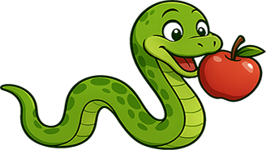
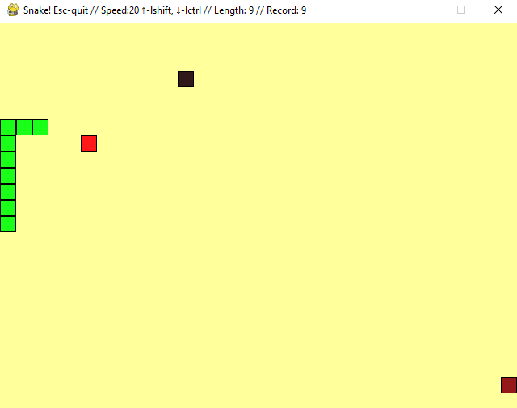

<table>
<tr>
<td>

</td>
<td>

# Змейка

 Классическая игра «Змейка», реализованная на Python с использованием Pygame и принципами ООП.  
Управляйте змейкой, ешьте яблоки, избегайте столкновений и увеличивайте длину!

</td>
</tr>
</table>

---

## Особенности
- **Классический геймплей**: Управляйте змейкой, поедая яблоки для увеличения длины.
- **Дополнительные механики**:
  - **Обычные яблоки**: Увеличивают длину на 1.
  - **Плохие яблоки**: Уменьшают длину на 1.
  - **Отравленные яблоки**: Сбрасывают игру.
- **Сквозное поле**: Змейка проходит через стены, появляясь с противоположной стороны.
- **Регулировка скорости**: Ускорение (Left Shift) и замедление (Left Ctrl).
- **Счёт**: Отображает текущую длину и рекорд в заголовке окна.
- **Столкновения**: Столкновение с собой сбрасывает игру.

---

## Технологический стек
- Python 
- Pygame 

---

## Установка

1. Клонируйте репозиторий: `git clone https://github.com/KuznetcovIvan/the_snake.git`
2. Перейдите в директорию с игрой: `cd the_snake`
3. Создайте и активируйте виртуальное окружение: `python -m venv venv`, `source/venv/Script/activate` (`python3 -m venv venv, source venv/bin/activate` для Linux / macOS).
3. Установите зависимости: `pip install -r requirements.txt`

---

## Использование
Запустите игру `python the_snake.py`

### Управление
- Стрелки: Изменение направления (вверх, вниз, влево, вправо).
- Left Shift: Увеличение скорости (до 50 FPS).
- Left Ctrl: Уменьшение скорости (до 5 FPS).
- Escape: Выход из игры.

---

### Автор [Иван Кузнецов](https://github.com/KuznetcovIvan)